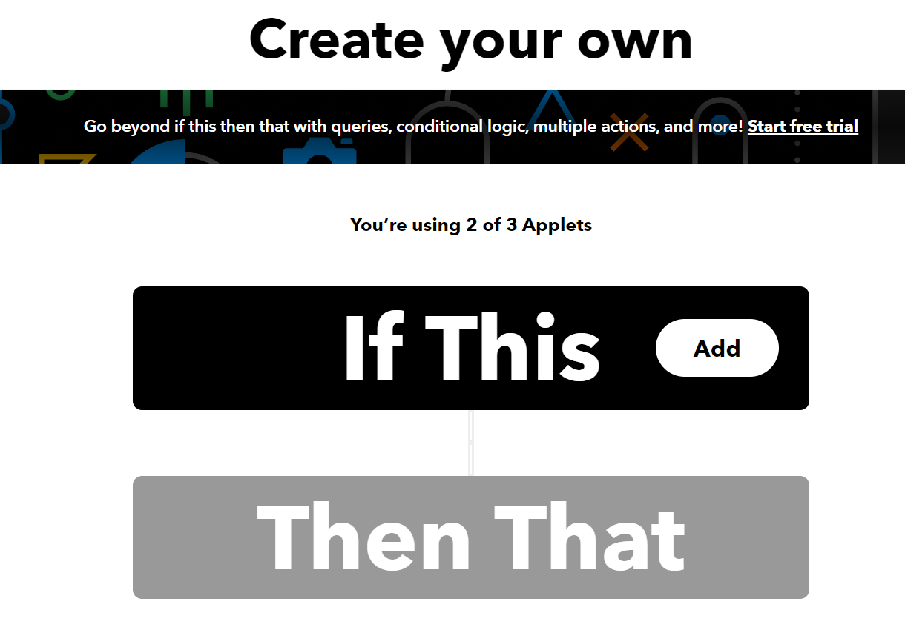

# GNIB OP

This is **not** official tool.

## Usage

Download [IFTTT](https://ifttt.com/home), Log in.

Click Create.

Click add

choose webhooks.

In 'Then' page, choose notification.

After all done.

In the documentation, find your key, Use it to replace the key and event name in the py file.

deploy py.

Done.